# ChessAI

In this project, I tried to create a Deep Learning-based AI that learns to play the game of chess by regressing [Stockfish](https://stockfishchess.org/) evaluation results on chess positions and using these results to make informed decisions in a MinMax search for the game tree. To this end, I trained a DNN with residual connections on about 10 million chess positions played online on lichess and annotated by the [Stockfish engine](https://stockfishchess.org/).

The engine ranks the different positions on a zero-centered scale that indicates the tendency of a player's advantage. 
This scale refers to the so-called "centi-pawns" scale. Thus, we consider not only the mere advantage in terms of number of pieces, but also the advantage in terms of position.

I have used [python-chess](https://python-chess.readthedocs.io/en/latest/) as a chess framework to focus entirely on the decision making of choosing the right move according to the rules of chess.
If you want to create your own chess-related project in Python, I recommend you to try it, as it is easy to use and well documented.


# Approach

To play chess, you just need to understand the rules and know what a good position is.
From this, we can define an engine that optimizes the position by playing moves that give the player an advantage while following the rules.

As indicated above, we don't need to worry too much about the rules, since python-chess handles move generation and other concepts such as mate, stalemate, etc.

Therefore, we only need to be able to recognize what a good position is and how to be able to use the current position to change the state of the board to one where we have a greater chance of winning.

For this we need to follow 5 steps:

- get data
- create dataset
- define model
- train model
- evaluate results and play some games of chess


To further increase strength I use opening- and a 5-piece endgame tables to ensure a high-level or even optimal play there.

# Data

The most commonly used data format for representing chess games is [Portable Game Notation (PGN)] (https://en.wikipedia.org/wiki/Portable_Game_Notation). Ideally, we collect .pgn data with annotated engine position ratings, since this would otherwise require a considerable amount of computation on our part.

Fortunately, there are many websites that provide such datasets. I would like to refer to the [data provided by LiChess](https://database.lichess.org/), as I used them for training in this project. They host over 1 TB or 3.5 billion chess games that can be used for free. 
Not every position is annotated in their database, but still about 10%, which is a lot.

If you are not familiar with the [PGN format] (https://en.wikipedia.org/wiki/Portable_Game_Notation), take a look now.
You will notice that a deep learning model cannot use this data without preprocessing (or perhaps some NLP that would be over-engineered).

So I had to extract the individual games/positions from the PGN and convert them into a usable format.

Below is a visualization of this process (a one hot encoding of the pieces on an 8 x 8 grid for each different type of piece).

| source |  |  |  |  |  |  |   |  |  |  |  |  |
|--|--|--|--|--|--|--|--|--|--|--|--|--|
| 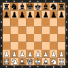 |  |  | 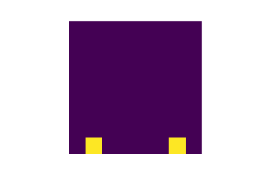 | 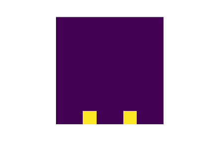 | 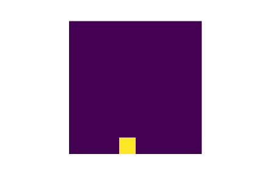 | 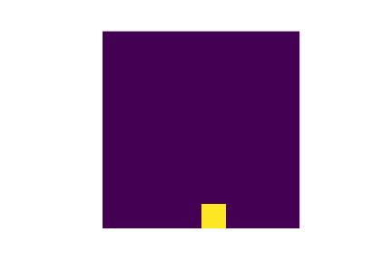 |  | 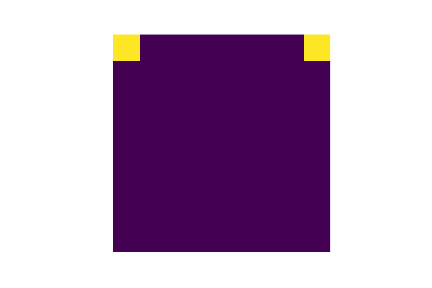 | 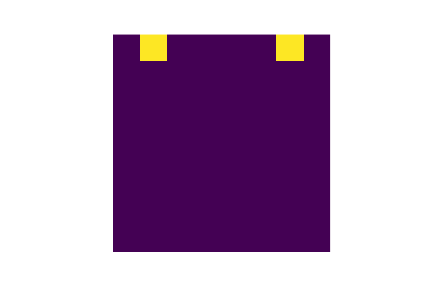 | 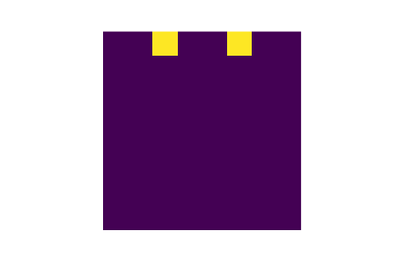 | 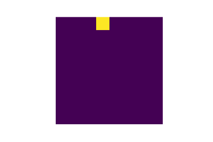 | 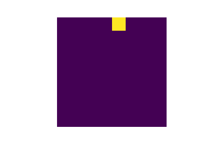 |

Each position is assigned an engine evaluation value (normalized from 0 for black wins and 1 for white wins).
And each board is mirrored to be viewed from the white player's perspective to facilitate the regression task.

This is then all stored in a SQLite database in compressed form, as the data is very sparse. 


# Dataset

I use a dataset that dynamically loads the desired elements from the SQL database.

# Model

I used 4 residual blocks with 2 internal fully connected layers of size 768, which are then reduced to 1 neuron that is later transformed to a logit with sigmoid. I use batch normalization to stabilize the training. The activation functions are all ReLUs.  
I tried using a CNN or even an FCNN, but the results were not as good as using a network with affine layers.

# Training

The entire training (and also the model) is simplified by using [PyTorch Lightning] (https://www.pytorchlightning.ai/), which provides a framework for boilerplate code for training.

The training process is logged and visualized using [Tensorboard] (https://www.tensorflow.org/tensorboard).

# Results

The following tensorboard plot displays the training process for the training loss (L1).

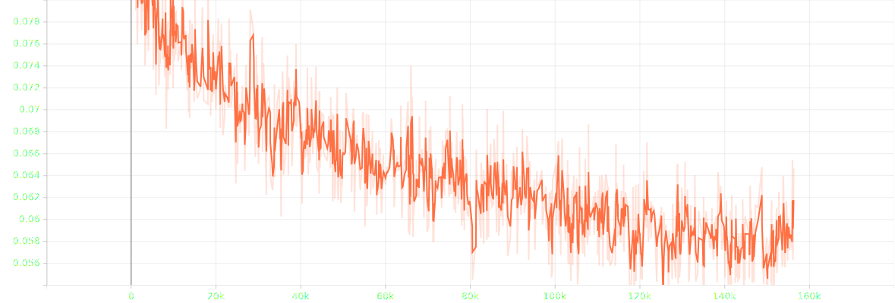

The following shows the validation loss.

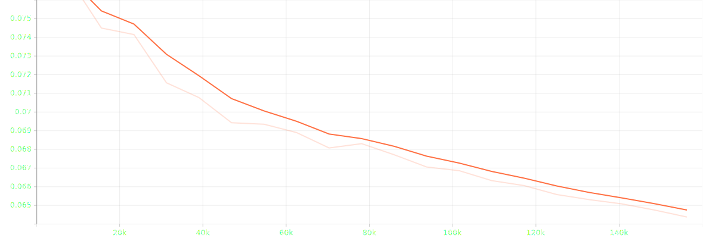


You can see that the engine learns and improves its game by looking at different positions.
In the end, the validation loss is 0.065, which means that the evaluation is only off by 6.5% on average.
Since both losses are still decreasing, further training could further improve the performance of the model.
However, since the training and data pre-processing was already very resource intensive (several hours, several GB load on GPU, SSD, etc.), I decided to stop further progress as it already showed a promising learning effect.

It could improve by quite a bit if the data used for training were selected more randomly.
The positions were perhaps not the most challenging, as
they are complete games, not played at a very high ELO rank, and therefore the positions are not i.i.d. and
most of the predictions either strongly tend to a black or white advantage or are almost perfectly balanced (i.e low ELO play entails major mistakes).
Therefore, the small tendencies that are needed are not really recognized.


SOTA results like Deepmind's AlphaZero obviously rely on considerable resources that cannot be accessed easily, and have far more complex architectures, training processes, and so on.

Nevertheless, it was possible to create a simple DNN that learns how to play chess at an entry level.


## Observations

The engine learned basic principles of chess, which should be familiar to beginners:

- Rooks should be connected
- Knights should not be placed on the edge of the board
- Control over the center is important
- Keep pieces protected
- move pawns forward to transform them into a superior piece
- keep the king safe
- do not lose material

Sure, the AI doesn't always play by these rules and still makes big mistakes, but still: by observing some games it played against herself, some notion of these principles can be interpreted into the decision making/moves of the engine


## Further impressions

Below you can see some games that the engine played, drawn with their position ratings.
You can see that my engine rated some positions very wrong and therefore played badly.


| my engine vs. my engine| Stockfish vs. my engine |
|--|--|
| 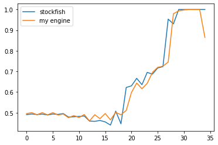 | 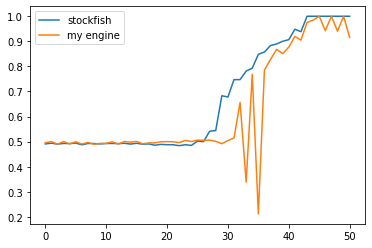 |


As you can see, the game that the machine played against itself is not evaluated quite differently from the game against stockfish.
That is interesting as the game on the left seems to be very simple and not very complicated to analyse, while the right game seems to contain more advanced tactics my engine wasn't able to evaluate correctly. This maks perfect sense as stockfish is a lot stronger agent then my engine. 


# Getting started

## Installing dependencies

The dependencies are managed using [poetry](https://python-poetry.org/)

**If you have not yet installed poetry**
```console
$ pip install poetry
```
**Change directory to the parent directory of this project and install the dependencies**  
```console
$ poetry install
```

Set your interpreter to be the poetry enviroment and run the Jupyter notebooks.

**To run tensorboard in your browser run**  

```console
$ tensorboard --logdir="chessai/tb_logs" --port=8080
```

**Now monitor the training under http://localhost:8080/#scalars**  


